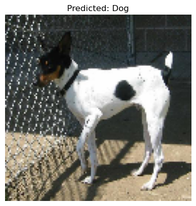

# 🐶🐱 **Dog vs Cat Image Classifier – "Is it a good boy or a grumpy cat?"** 📸
**Inspired by** classic computer vision tasks and the joy of distinguish floofs. 
> Ideas from [aswintechguy](https://github.com/aswintechguy/Deep-Learning-Projects/tree/main/Dogs%20vs%20Cats%20Image%20Classification%20-%20CNN)


## 🚀 **Project Overview**
This project tackles a binary image classification problem: given a picture, is it a **dog** or a **cat**?

Using **CNN (Convolutional Neural Network)** built with `keras`m we train the model on thousands of labeled dog and cat images (25,000 pictures!), applying data augmentation to boost generalization.

## 🎯 **Project Goal**
To train and evaluate a deep learning model capable of classifying images of cats and dogs with high accuracy.

Two key modules:
* **Data Preprocessing**: Load, clean, label, and augment image data.
* **Model Training**: Build and train a CNN using TensorFlow/Keras.

## 📦 **Dataset**
* Source: [Microsoft Dogs vs. Cats Dataset](https://download.microsoft.com/download/3/E/1/3E1C3F21-ECDB-4869-8368-6DEBA77B919F/kagglecatsanddogs_5340.zip).
* After downloading:
```bash
# 1. Download ZIP
wget https://download.microsoft.com/download/3/E/1/3E1C3F21-ECDB-4869-8368-6DEBA77B919F/kagglecatsanddogs_5340.zip

# 2. Unzip
unzip kagglecatsanddogs_5340.zip

# You'll find a folder named PetImages with Cat/ and Dog/ subfolders
```

## 🧱 **Tech Stack**
* **Language**: Python
* **Libraries Used**:
    * `numpy`, `pandas`, `matplotlib`, `seaborn`
    * `sklearn` for train/test split
    * `tensorflow.keras` for model creation and training
    * ...

## ⚙️ **Project Workflow**
### **1. 🗃️ Data Preprocessing**
* Read images from `PetImages/Cat` and `PetImages/Dog`
* Assign labels: `0` for Cat and `1` for Dog.
* Remove unreadable/corrupted images
* Shuffle and save the dataframe as `images_clf.csv`.

### **2. 🔄 Data Augmentation & Image Generators**
```python
train_generator = ImageDataGenerator(
    rescale=1./255,
    rotation_range=40,
    shear_range=0.2,
    zoom_range=0.2,
    horizontal_flip=True,
    fill_mode='nearest')

val_generator = ImageDataGenerator(rescale=1./255)
```
* Randomly transforms training images to prevent overfitting.
* Normalizes pixel values to $[0, 1]$ range.

### **3. 🧠 Model Architecture**
```python
model = Sequential([
    Conv2D(16, (3, 3), activation='relu', input_shape=(128, 128, 3)),
    MaxPool2D((2, 2)),
    Conv2D(32, (3, 3), activation='relu'),
    MaxPool2D((2, 2)),
    Conv2D(64, (3, 3), activation='relu'),
    MaxPool2D((2, 2)),
    Flatten(),
    Dense(512, activation='relu'),
    Dense(1, activation='sigmoid')])
```
* **Loss**: Binary Crossentropy
* **Optimizer**: Adam
* **Metrics**: Accuracy

### **4. 🔍 Model Summary**

```python
Model: "sequential"
____________________________________________________________________
 Layer (type)                   Output Shape                Param #   
====================================================================
 conv2d (Conv2D)                (None, 126, 126, 16)        448       
 max_pooling2d (MaxPooling2D)   (None, 63, 63, 16)          0         
 conv2d_1 (Conv2D)              (None, 61, 61, 32)          4640      
 max_pooling2d_1 (MaxPooling2D) (None, 30, 30, 32)          0         
 conv2d_2 (Conv2D)              (None, 28, 28, 64)          18496     
 max_pooling2d_2 (MaxPooling2D) (None, 14, 14, 64)          0         
 flatten (Flatten)              (None, 12544)               0         
 dense (Dense)                  (None, 512)                 6423040   
 dense_1 (Dense)                (None, 1)                   513       
====================================================================
Total params: 6,447,137
Trainable params: 6,447,137
Non-trainable params: 0
```

### **📈 Sample Output**

```
Image: PetImages\Dog\710.jpg
Predicted Label: Dog
```

## 🧪 **Random Image Test**

After training, a random image from the dataset is loaded and classified:

```python
sample_rows = df.sample(n=3).reset_index(drop=True)

for i in range(3):
    image_path = sample_rows.loc[i, 'images']
    label_value = sample_rows.loc[i, 'label']

    img = load_img(image_path, target_size=(128, 128))
    img_array = img_to_array(img) / 255.0
    img_array = img_array.reshape(1, 128, 128, 3)

    pred = model.predict(img_array, verbose=0)
    predicted_label = 'Dog' if pred[0][0] > 0.5 else 'Cat'

    plt.imshow(img)
    plt.axis('off')
    plt.title(f"Predicted: {predicted_label}")
    plt.show()

    print(f"Image: {image_path}")
    print(f"Predicted Label: {predicted_label}\n")
```

## 📁 **File Structure**

```bash
📦 dogs-vs-cats/
├── 📁 PetImages/                       # Raw dataset (Cat/ and Dog/ folders)
│   ├── 📁 Cat
│   ├── 📁 Dog
├── convert-to-dataframe.py             # Script to clean and label data
├── images_clf.csv                      # Cleaned dataset CSV
├── dogs-cats-classification.ipynb      # Notebook for training + evaluation
├── project-banner.png                  # Visual for README
└── README.md                           # This file
```

## 🧩 **Future Improvements**

* Add dropout layers for regularization
* Experiment with pretrained models (e.g., VGG16, ResNet)
* Convert model to TensorFlow Lite or deploy via Flask
* Add multiclass support if expanding beyond dogs/cats

# 💬 **Contact**

Still exploring deep learning, always open to feedback, suggestions, or memes of cats in code!<br>
📧 [Gmail](andrhmdk@gmail.com)<br>
🔗 [LinkedIn](https://www.linkedin.com/in/hmdkien/)